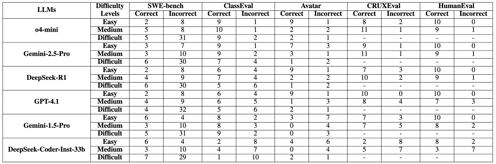
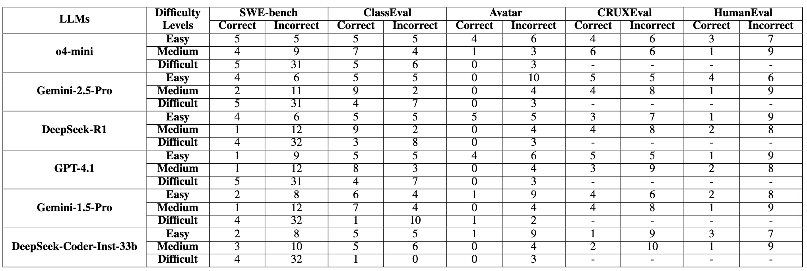

    <em>Table 1. Distribution of the correct and incorrect predictions across difficulty levels and datasets on output prediction</em>

    

    <em>Table 2. Distribution of the correct and incorrect predictions across difficulty levels and datasets on input prediction</em>

    

